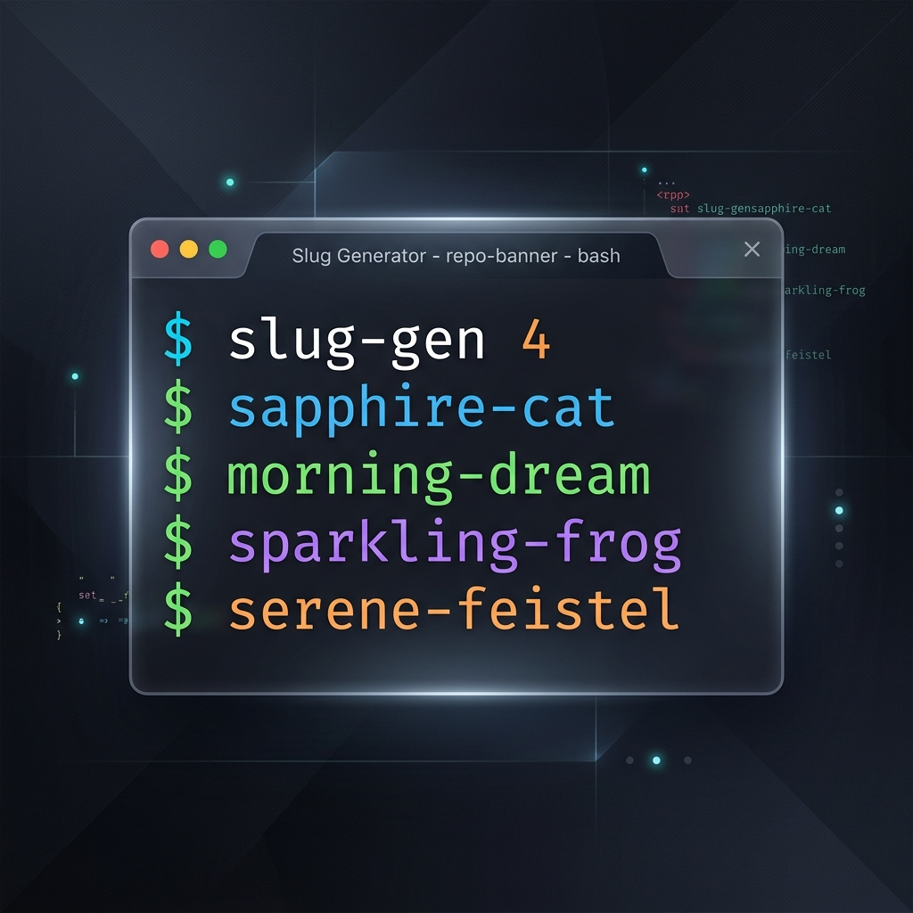

# Slug Generator


`slug` `generator` `docker` `random` `cli` `nodejs`

<p align="center">
  
</p>

A professional-grade command-line utility for generating high-entropy, Docker-style random identifiers. This tool combines adjectives and nouns to create human-readable slugs suitable for project names, container identifiers, or unique session keys.


## Overview

Slug Generator is designed to provide unique, memorable strings by pairing a diverse set of adjectives with a broad list of nouns including famous scientists, animals, objects, and technical concepts. It is built for speed, simplicity, and reliability.

## Key Features

- Extensive Wordlist: Combines Docker's original list of scientists and adjectives with hundreds of additional curated terms across multiple domains.
- Zero Dependencies: A standalone Node.js script that requires no external packages.
- High Collision Resistance: With over 300 adjectives and 700 nouns, the generator offers hundreds of thousands of unique combinations.
- Bulk Generation: Supports generating multiple slugs in a single execution.

## Installation

### Global Installation

To install the utility globally on your system:

```bash
npm install -g .
```

### Local Usage

You can also run the utility without installation using npx:

```bash
npx slug-gen
```

## Usage

### Generate a Single Slug

Run the command without arguments to output a single random slug:

```bash
slug-gen
```

### Bulk Generation

Specify a number as an argument to generate multiple slugs:

```bash
slug-gen 10
```

## Technical Details

The generation logic follows the `adjective-noun` pattern. The wordlist is statically embedded within the binary to ensure zero-latency execution and portability.

### Wordlist Categories

- Scientific: Famous mathematicians, physicists, and computer scientists.
- Natural: Animals, celestial bodies, and geographic features.
- Technical: Computing terminology and engineering concepts.
- Qualitative: Diverse adjectives covering various states and attributes.

## License

This project is licensed under the MIT License. See the LICENSE file for details.
